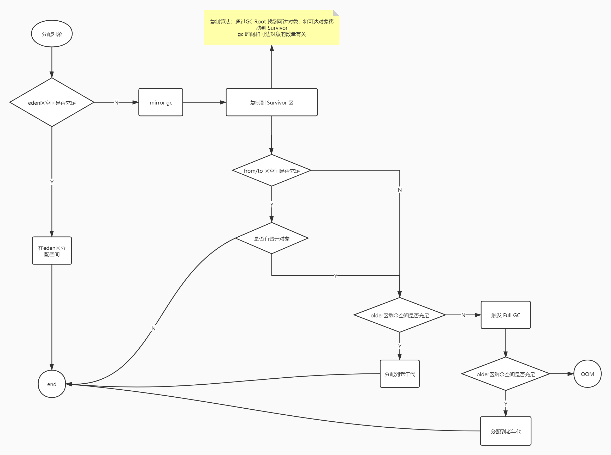

### GC 以及 流程




### 常见 gc 搭配

* Serial + Serial Old (基本不用)
* ParNew + CMS + Serial Old 
* PS + PO

生产环境中比较常用的就是第二种和第三种，PS + PO 是 jdk8 默认的垃圾回收器，特点是 Mirror GC 和 Full GC 都是并行且全程 STW 的。传达的思想是，通过并行提高 gc 效率

CMS 则是将 Full GC 这个大步骤分成几个小的步骤，通过将其中的一些步骤与用户线程并行化，来减少 STW 的时间。传达的思想就是分治。

### CMS 流程以及原理


* 初始标记(STW)
    * 只标记 GC Roots 能直接关联到的对象
* 并发标记
    * 进行 GC Roots Tracing 的过程，因为和用户线程是并行的，所以不会停顿。但是耗 CPU 资源
    * 会出现漏标以及浮动垃圾
* 重新标记(STW)
    * 就是为了解决漏标的问题，但是无法处理浮动垃圾
* 并发清理

优点：大大降低了 GC 停顿时间，即响应时间
缺点：耗 CPU、浮动垃圾、GC 退化、碎片化

Full GC 的触发条件

* 老年代达到阈值（-XX:+UseCMSInitiatingOccupancyOnly -XX:CMSInitiatingOccupancyFraction=75）
* 新生代的晋升担保失败：判断老年代是否有足够的空间来容纳全部的新生代对象或者历史平均晋升到老年代的对象，如果不够，就进行一次 Full GC(退化成为了 Serial Old )


#### 三色标记

* 初始标记（单线程执行，1.8 之后并行）
    * 标记GC Roots 直接可达的老年代对象
    * 遍历新生代对象，标记直接可达的老年代对象


##### jvm 推荐启动参数

```
 // 性能相关
-XX:-UseBiasedLocking 
-XX:-UseCounterDecay 
-XX:AutoBoxCacheMax=20000 
-XX:+PerfDisableSharedMem 
-XX:+AlwaysPreTouch 
-Djava.security.egd=file:/dev/./urandom

// 内存大小相关
-Xms3800m -Xmx3800m
-Xmn1900m -Xss256k 
-XX:MetaspaceSize=128m -XX:MaxMetaspaceSize=512m 


// GC策略
-XX:+UseConcMarkSweepGC 
-XX:+UseCMSInitiatingOccupancyOnly 
-XX:CMSInitiatingOccupancyFraction=75 
-XX:+ExplicitGCInvokesConcurrent
-XX:-CMSClassUnloadingEnabled 
-XX:+CMSScavengeBeforeRemark

// GC 线程
ParallelGCThreads＝8+( Processor - 8 ) ( 5/8 )；
ConcGCThreads = (ParallelGCThreads + 3)/4


// 监控
-XX:+PrintCommandLineFlags 
-XX:-OmitStackTraceInFastThrow
-XX:ErrorFile=${MYLOGDIR}/hs_err_%p.log
-XX:+HeapDumpOnOutOfMemoryError -XX:HeapDumpPath=${LOGDIR}/

// GC日志
-Xloggc:/dev/shm/gc-myapp.log -XX:+PrintGCDateStamps -XX:+PrintGCDetails  
-XX:+PrintGCApplicationStoppedTime 
-XX:+PrintPromotionFailure

// JMX
-Dcom.sun.management.jmxremote.port=9981 
-Dcom.sun.management.jmxremote.ssl=false 
-Dcom.sun.management.jmxremote.authenticate=false 
-Dfile.encoding=UTF-8

// 开启 jfr
-XX:+UnlockCommercialFeatures -XX:+FlightRecorder
```
