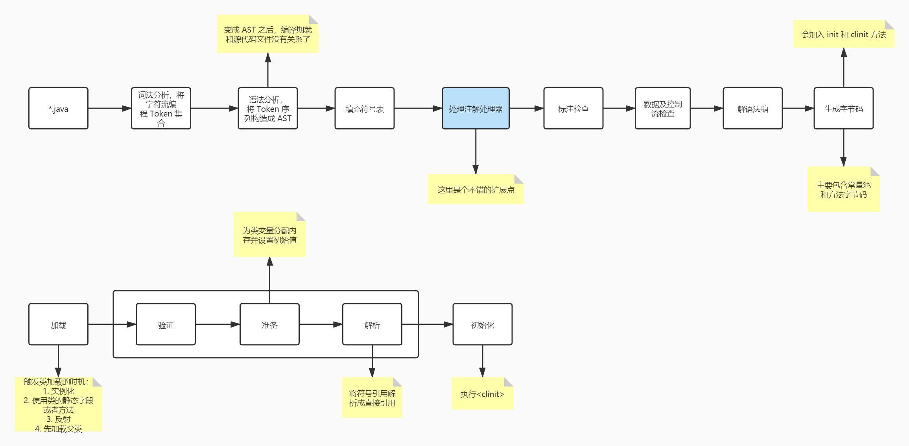
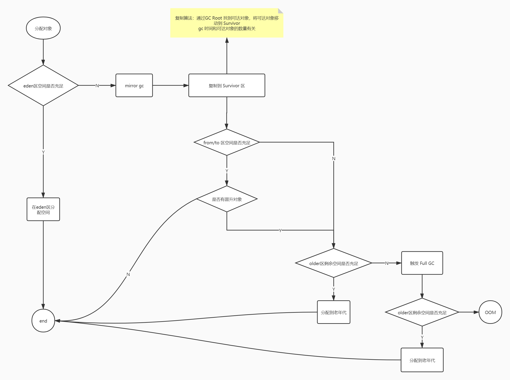

[TOC]

### jvm 需要了解的知识点

* 编译期：知道注解处理器这个扩展点即可(lombok)
* 运行期
    * 类的加载 -> 对象的创建 -> 方法调用 -> GC
    * java agent

-------

--------

#### 注解处理器和 java agent

两者都可以检测或者修改字节码，从而实现通用功能。代表作：lombok 和 Arthas

他们的核心都是为了隔离业务功能和通用功能，这是不是和 spring aop 很像

结合注解处理器、agent、spring，可以看出一个对象的最终形态是由它执行前所有步骤(编译、运行)共同决定的。也就是说，如果我们想改变一个对象的形态，也是有多种方式的，只不过像 spring
这种框架简化了这种实现方式，但是本质上没什么差别。

一种是修改字节码，一种是函数套函数

通过这种修改生命周期中的某一环节，来扩展功能的设计模式是非常常见的，比如说 CI/CD 中的钩子，各种责任链、事件模型。这里也可以总结出一个奥义：

> 奥义一：通过 生命周期 + 钩子 这种设计模式，可以使代码具有扩展性

业务中的运用：业务流程 + 领域事件

#### 类的加载

* 加载
    * 通过全限定类名获取二进制字节流
        * 从 zip、jar、war 中获取
        * 从网络获取
        * 运行时计算生成，动态代理技术
    * 将这个二进制字节流所代表的静态存储结构转化为方法区的运行时数据结构
    * 在内存中生成代表这个类的 Class 对象，作为方法区这个类的各种数据的访问入口
* 链接（和加载时交叉执行的）
    * 验证：保证字节流的正确性(优化点：-Xverify:none 关闭大部分的类验证措施)
        * 文件格式验证
        * 元数据验证
        * 字节码验证
        * **符号引用验证**（发生在解析阶段）
    * 准备：为**类变量**分配内存并设置初始值
        * ConstantValue (final)
        * 将非 final 的静态变量赋值操作放到 <clinit> 中
    * 解析：将常量池中的部分符号引用替换为直接引用
        * 类或接口解析：这一步会触发连锁加载
        * 字段解析：触发字段所属类或接口符号引用的解析
        * 方法解析
        * 接口方法解析
* 初始化：执行 <clinit>
    * 所有类变量的赋值动作以及静态快的处理
    * 父类的 <clinit> 在子类之前处理，接口除外
    * <clinit> 方法是线程安全的

#### 对象的创建

* 检查 new 指令的参数是否能在**常量池**中定位到一个类的**符号引用**，并且检查这个符号引用代表的类是否完成**加载**、**解析**和**初始化**过程。如果没有，则触发类加载
* 完成类加载之后，就给对象分配内存。分配内存的方式由垃圾收集器决定（一种是连续分配，一种是非连续分配）
    * 带有压缩功能的 GC 收集器，一般是内存规整的，就采用 Bump the Pointer
    * 非内存规整的，则采用 Free list
    * 内存分配的并发问题
        * CAS
        * 每个线程有自己的堆内存（Thread Local Allocation Buffer）
* 内存分配完成，虚拟机将分配的空间都初始化为零，这一步确保了对象的实例字段在不被赋值的时候被使用。其实就是只实例化，不初始化，和 spring getBean 一样，也是分实例化和初始化两个阶段
* 接下来，虚拟机对对象进行必要的设置。比如对象是哪个类的实例、如何获取类的元信息、对象的哈希码、等等
* 执行 <init> 方法，进行对象的初始化

#### 方法的调用

* 字节码的执行
    * 栈帧组成：局部变量表、操作数栈、动态链接、返回地址
        * 局部变量表：在编译期确定大小，可以看成是存储局部变量的数组
        * 操作数栈：通过出入栈来执行指令
        * 动态链接：指向运行时常量池中该栈帧所属方法的引用，第二次将符号引用转换成直接引用
    * 方法调用
        * 静态解析：解析阶段的时候解析，这时候方法的版本确定，主要是静态方法和私有方法两种（invokestatic、invokespecial）
        * 动态解析
    * 分派
        * 静态多分派：方法重载
        * 动态单分派：方法重写
            * 通过虚方法表来共享父类中未被重写的方法地址
    * 基于栈的字节码解释引擎
        
#### GC

