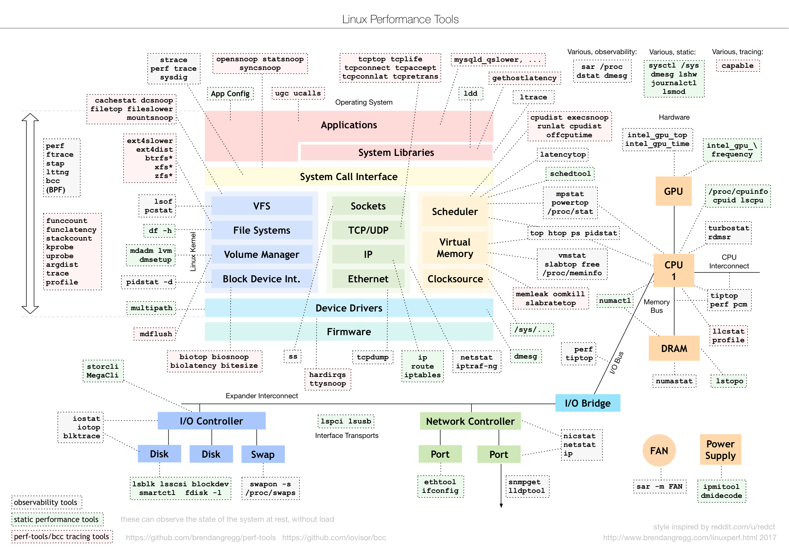

### 关健概念

**性能指标**

* 从 App 的视角，主要是**吞吐**和**延迟**
* 从系统的视角，就是资源利用率和饱和度

**性能的本质问题**：就是系统资源已经达到瓶颈，但是吞吐量不高，响应不够快

**性能分析的目的**：找出应用或系统的瓶颈，并设法避免或者缓解它们

#### 性能分析步骤

选择指标评估应用程序和系统的性能 -> 为应用程序和系统设置性能目标 -> 进行性能基准测试 -> 性能分析定位瓶颈 -> 优化系统和应用程序
-> 性能监控和报警

#### 重点

建立整体系统性能的全局观

* 理解最基本的几个系统知识原理
* 掌握必要的性能工具
* 通过实际场景演练，贯穿不同的组件

#### 技巧

> 理解应用程序和系统的少数基本原理，通过大量的模拟练习，建立起整体性能的全局观

* 先面后点，不要死扣细节
    * 思考哪些指标可以衡量性能
    * 使用什么样的工具来观察指标
    * 导致这些指标变化的因素
* 知行合一，通过案例掌握性能分析的技能
* 反思和总结，多问为什么，形成自己的知识体系

#### 思维导图

