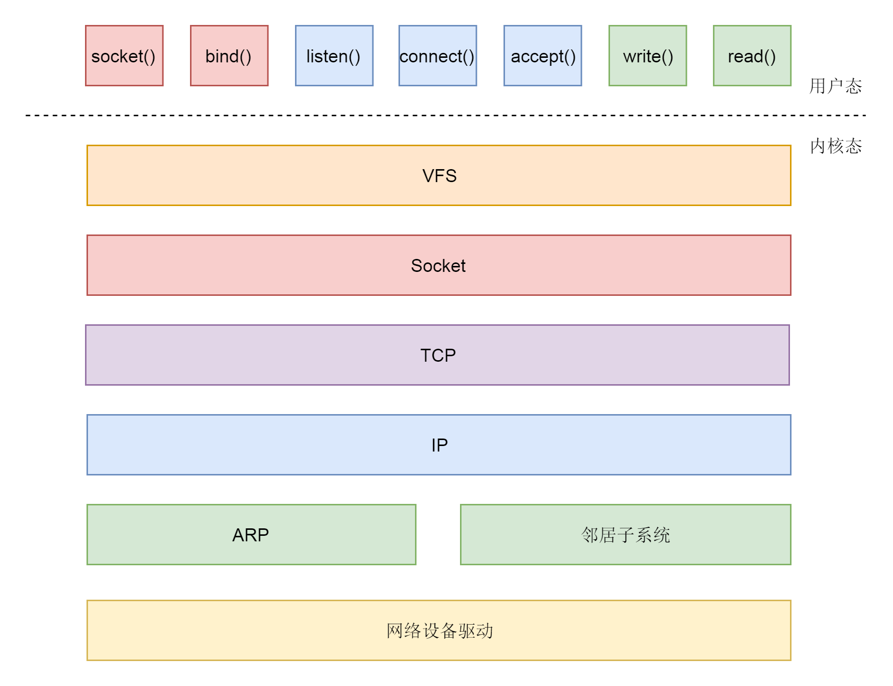

# Socket通信

连接的本质在于，通过客户端和服务端建立一定的数据结构来维护双方的状态。当双方的状态一致时，连接就是可靠的。所以连接的核心在于两端的数据结构，而不是通道。

```c
// 调用 socket 函数，创建一个 socket 的文件描述符
/**
* domain：表示使用什么 IP 层协议。AF_INET 表示 IPv4，AF_INET6 表示 IPv6
* type：表示 socket 类型。SOCK_STREAM，顾名思义就是 TCP 面向流的，SOCK_DGRAM 就是 UDP 面向数据报的，SOCK_RAW 可以直接操作 IP 层，或者非 TCP 和 UDP 的协议。例如 ICMP
* protocol 表示的协议，包括 IPPROTO_TCP、IPPTOTO_UDP
*/
int socket(int domain, int type, int protocol);
```


```c
/**
* sockfd 是上面我们创建的 socket 文件描述符
* 服务端进行绑定
*/
int bind(int sockfd, const struct sockaddr *addr,socklen_t addrlen);

struct sockaddr_in {
  __kernel_sa_family_t  sin_family;  /* Address family    */
  __be16    sin_port;  /* Port number      */
  struct in_addr  sin_addr;  /* Internet address    */

  /* Pad to size of `struct sockaddr'. */
  unsigned char    __pad[__SOCK_SIZE__ - sizeof(short int) -
      sizeof(unsigned short int) - sizeof(struct in_addr)];
};

struct in_addr {
  __be32  s_addr;
};


// 服务端进行监听
int listen(int sockfd, int backlog);

// 等待连接的建立
int accept(int sockfd, struct sockaddr *addr, socklen_t *addrlen);

```

客户端

```c
int connect(int sockfd, const struct sockaddr *addr, socklen_t addrlen);
```



流程

* 服务端和客户端都调用 socket，得到文件描述符
* 服务端调用 listen，进行监听
* 服务端调用 accept，等待客户端连接
* 客户端调用 connect，连接服务端
* 服务端 accept 返回用于传输的 socket 的文件描述符
* 客户端调用 write 写入数据
* 服务端调用 read 读取数据
