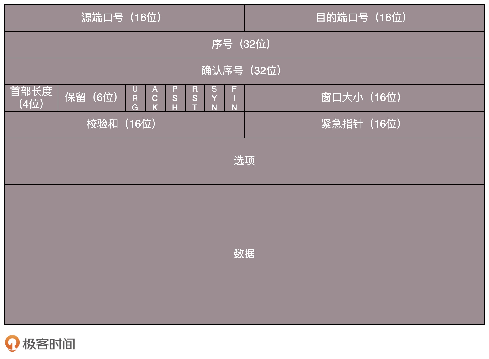

### Tcp 核心问题

**TCP 包头格式**

* 序号是为了解决**乱序问题**
* 确认序号是为了解决**不丢包**问题
* SYN 是发起一个连接，ACK 是回复，RST 是重新连接，FIN 是结束连接等。**维护连接**
* 窗口大小是为了**流量控制**

-----

**核心问题**

* 顺序问题 ，稳重不乱；
* 丢包问题，承诺靠谱；
* 连接维护，有始有终；
* 流量控制，把握分寸；
* 拥塞控制，知进知退

#### Tcp 握手和挥手

* 为了保证可靠性，每一端都需要两次交互，所以应该是 4 次握手，但是服务端这边可以合并 ack + syn，所以是 3 次握手

#### 如何实现一个靠谱的协议

* 保证消息的顺序性，也就是每个包都有 id (解决了顺序问题)
* 通过累计应答，保证性能的同时，保证不丢包 （解决了丢包问题）

**发送端**

* LastByteAcked：第一部分和第二部分的分界线LastByteSent：
* 第二部分和第三部分的分界线LastByteAcked + AdvertisedWindow：
* 第三部分和第四部分的分界线对于接收端来讲，它的缓存里记录的内容要简单一些。

**接收端**

* MaxRcvBuffer：最大缓存的量；
* LastByteRead 之后是已经接收了，但是还没被应用层读取的；
* NextByteExpected 是第一部分和第二部分的分界线

------

**丢包问题**

比如说 8/9 号包已接收，6、7 号包未接收。这时候就会触发自适应重传算法  