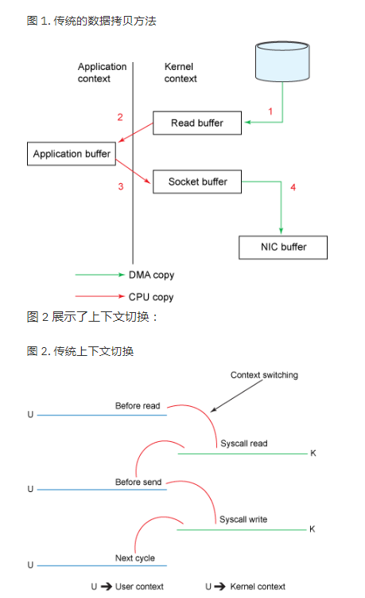
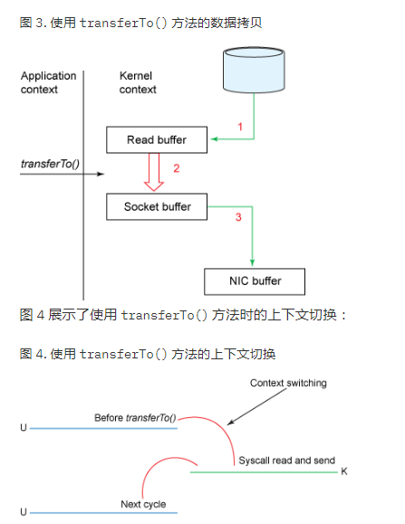
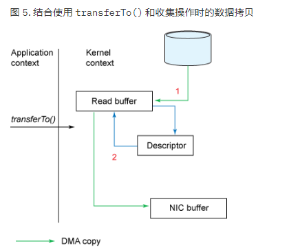

### 零拷贝技术

[IBM原文](https://www.ibm.com/developerworks/cn/java/j-zerocopy/)

### 限制

* 数据无需在用户程序中处理

### 传统拷贝和零拷贝的区别

> 使用的是 ssize_t sendfile(int out_fd, int in_fd, off_t *offset, size_t count); 系统调用
> java 实现改功能的 API 是 FileChannel#transferTo()

 

* 4 次数据拷贝
* 4 次系统调用

* 3 次数据拷贝
* 2 次系统调用

* 2 次数据拷贝
* 2 次系统调用